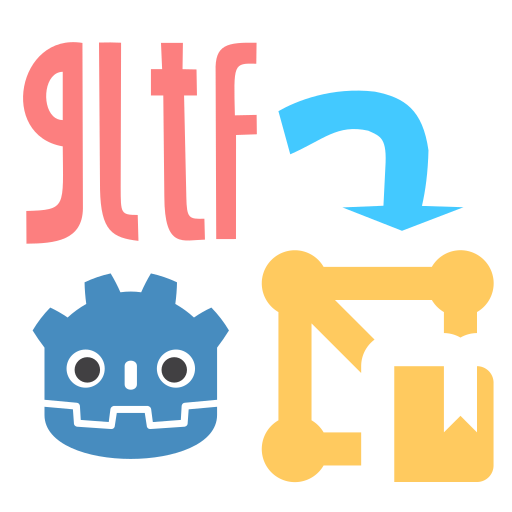
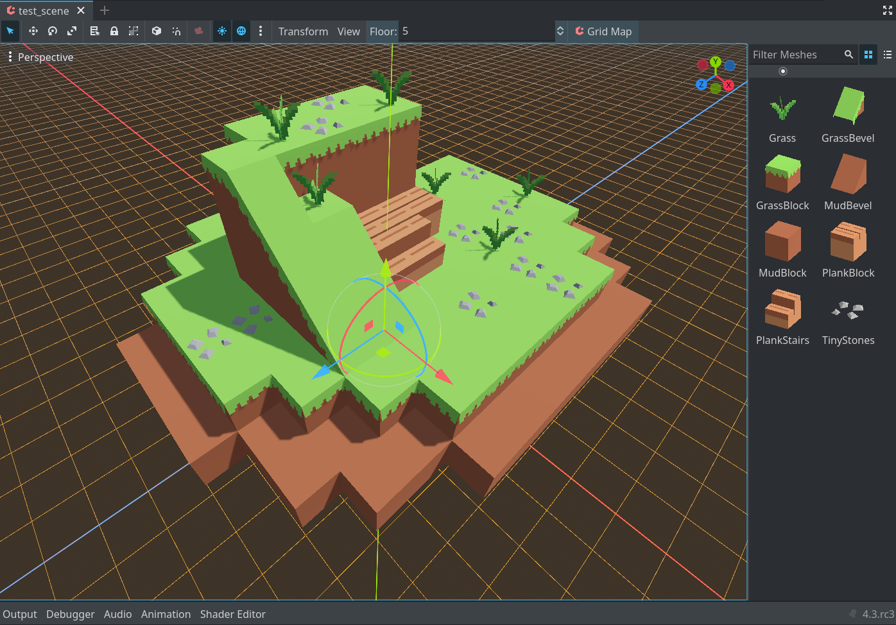
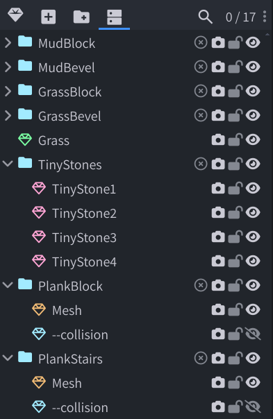
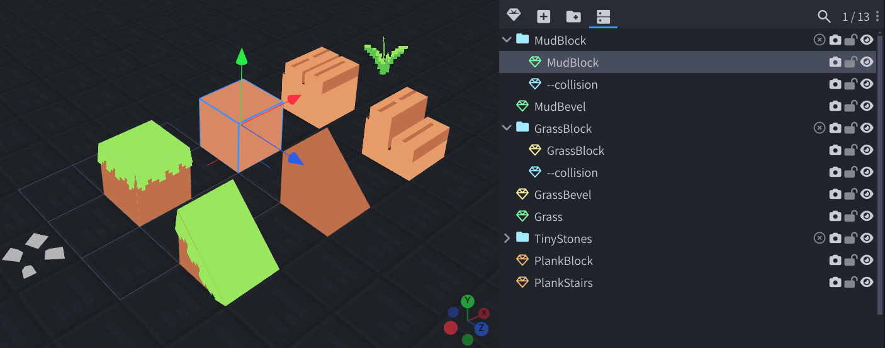

# GLTF2MeshLib

This plugin allows you to import gltf/glb models as MeshLibrary, which saves a lot of time compared to manual importing.

## Usage

you can simply drag and drop gltf/glb files into the editor, select "`GLTF To MeshLibrary`" in the import settings, and it will automatically import your gltf/glb as a MeshLibrary. This allows you to see instant changes after any modification of the gltf file.

In my case, I used models made with Blockbench, exported as gltf, and imported into Godot with this plugin, and it seems to work fine as I expected. I am using `Godot 4.3`.

If you encounter any problems, or if you have any suggestions, please let me know in the Issues.

## Requirements

Different from godot's default behavior, you need to make sure models you want to import are in the first level. things in sublevels would be imported as a part of the parent object.

here's an example:

## Options

| Option                           | Description                                                             | Default      |
| -------------------------------- | ----------------------------------------------------------------------- | ------------ |
| generate_collision_shape_by_mesh | generate collision shape by its model, rather than "-col" tagged meshs. | false        |
| generate_preview                 | whether to generate preview for MeshLibrary.                            | true         |
| model_offset                     | You can adjust model offset via this parameter.                         | Vector3.ZERO |
| sort_by_name                     | Sort Items in MeshLibrary. Preventing unexpected order.                 | true         |

### Flags

Now you can import Items with flags. Currently there're 2 kinds of flags available:

| Flag                    | Description                                                                |
| ----------------------- | -------------------------------------------------------------------------- |
| `--collision` or `-col` | whether to import this object as collision shape or not. false by default. |
| `--noimp`               | whether to import this object or not. false by default.                    |

Here's an example:

You can configure collision by adding meshes that indicates the collision shape of the item, and add `--collision` flag to the item.

## Known Issues

- re-importing GLTF with opened scene in Editor with GridMap node which binds the imported gltf, would raise `"servers/rendering/renderer_rd/storage_rd/mesh_storage.cpp:632 - Parameter "mesh" is null."`.

- for some reason, the editor might raise annoying "Attempted to call reimport_files() recursively, this is not allowed." error while importing mesh as MeshLibrary.

Thankfully this issue seems not influencing the game, but it's still annoying.Do you got any solutions? I need you help on this :(

let me know more problems you encountered in issues.

## Contributors

please view the "contributors" page on the right side(if you are reading this via github).

## License

License under MIT License.
